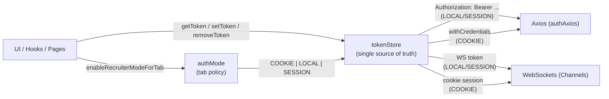
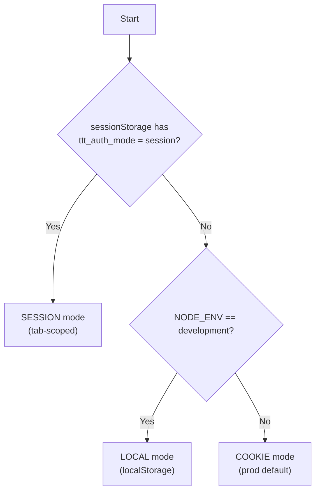

# Auth Storage Architecture (Mode-Aware Authentication)

This document describes the **Mode-Aware Authentication** pattern used in this project.  
It enables the app to switch authentication storage strategies at runtime—**without rewriting** Axios, hooks, WebSockets, or UI code.

---

## Problem this architecture solves

Browsers share authentication state across tabs when using:

- **Cookies** (shared across tabs)
- **localStorage** (shared across tabs)

For recruiter demos, QA, multiplayer testing, and "two users in one browser" workflows, we need:

- **Two simultaneous sessions in two tabs**
- **No incognito**
- **No duplicated auth logic**

This architecture achieves that by introducing a **tab-scoped auth mode** using **sessionStorage**, while preserving existing behavior:

- Production → cookie-based auth (default)
- Development → localStorage-based auth (default)
- Recruiter/Demo → sessionStorage-based auth (per tab)

---

## Design goals

1. **Storage is a policy**  
   The app should not hardcode “cookies” or “localStorage” into business logic. Storage selection must be centralized and configurable.

2. **One source of truth for tokens**  
   There must be exactly one adapter that knows how to:
   - set token
   - get token
   - remove token
   - clear auth artifacts

3. **Transport is separate from storage**  
   How tokens are stored is separate from how they’re sent:
   - cookie mode → `withCredentials` and server-managed cookies
   - token modes → `Authorization: Bearer ...`

4. **Tab isolation is intentional**  
   Recruiter/Demo sessions must be isolated per-tab using sessionStorage.

5. **Minimal changes to the rest of the app**  
   Axios, hooks, and sockets should call `getToken(...)` and stay storage-agnostic.


---

## Diagram: how Mode-Aware Authentication works

### System flow (mode → token store → transports)



### Mode selection rules (decision tree)



> If your Markdown renderer does **not** support Mermaid, keep the diagrams and also include the ASCII fallback below.

### ASCII fallback

```
               (per tab override)
      ┌─────────────────────────────┐
      │ authMode (policy selector)   │
      │ - SESSION if tab override    │
      │ - else LOCAL in dev          │
      │ - else COOKIE in prod        │
      └──────────────┬──────────────┘
                     │ selects mode
                     v
      ┌─────────────────────────────┐
      │ tokenStore (single adapter)  │
      │ set/get/remove tokens        │
      │ clear cookie artifacts       │
      └───────┬─────────────┬───────┘
              │             │
   LOCAL/SESSION            COOKIE
 Authorization header      withCredentials
              │             │
              v             v
        ┌─────────┐     ┌─────────┐
        │  Axios  │     │  Axios  │
        └─────────┘     └─────────┘
              │             │
              v             v
        ┌─────────┐     ┌─────────┐
        │ WebSocket│     │ WebSocket│
        └─────────┘     └─────────┘
```


---

## The three auth modes

| Mode | Storage | Scope | Default Use |
|------|---------|-------|-------------|
| `COOKIE` | httpOnly cookies (and cookie artifacts) | Shared across tabs | Production |
| `LOCAL` | localStorage | Shared across tabs | Development |
| `SESSION` | sessionStorage | **Per tab** | Recruiter/Demo |

---

## Architecture: modules and responsibilities

### 1) `authMode` — Mode Selector (Policy)

**Responsibility:** Decide which auth mode is active **for this tab**.

Rules:
- If a tab override exists → use `SESSION`
- Else if environment is development → use `LOCAL`
- Else → use `COOKIE`

Exports:
- `getAuthMode()`
- `enableRecruiterModeForTab()`
- `disableRecruiterModeForTab()`

**Why this matters:**  
Mode selection should never live inside hooks or components. One place decides the policy.

---

### 2) `tokenStore` — Storage Adapter (Implementation)

**Responsibility:** Provide a single API for all token operations, regardless of storage mechanism.

Exports:
- `setToken(name, value, options?)`
- `getToken(name)`
- `removeToken(name)`
- `clearAuthCookies()`

**Rule:**  
No other code should call:
- `Cookies.get/set/remove`
- `localStorage.getItem/setItem/removeItem`
- `sessionStorage.getItem/setItem/removeItem`

Everything goes through `tokenStore`.

---

### 3) `useAuthAxios` — HTTP Transport + Refresh Controller

**Responsibility:**
- Attach auth to requests
- Refresh tokens on 401
- Perform logout cleanup on auth failure
- Avoid refresh storms with a **single-flight** refresh promise

Key behaviors:
- Reads tokens only via `tokenStore.getToken()`
- Sends cookies only when mode is `COOKIE`
- Adds `Authorization` header when mode is `LOCAL` or `SESSION`

**Single-flight refresh:**
- If multiple requests fail with 401 at once, only **one** refresh request is executed.
- All failed requests wait for that refresh promise and retry with the new token.

---

### 4) WebSocket hooks — Mode-aware socket auth

**Responsibility:**  
Authenticate WS connections by fetching the token via:

- `getToken("access_token")`

This makes all WebSocket features automatically compatible with recruiter mode, without duplicating logic.

---

## Recruiter Demo Mode (two tabs, no incognito)

Recruiter mode is implemented as a **tab-scoped override**:

- When enabled, tokens are stored in `sessionStorage` for that tab only.
- A second tab can enable the same mode but log in as a different user, without interference.

**Typical flow**
1. User opens `/recruiter`
2. Clicks “Login as Player 1”
3. The app calls `enableRecruiterModeForTab()` then stores tokens in sessionStorage
4. User opens a second `/recruiter` tab
5. Clicks “Login as Player 2”
6. Each tab runs independently

---

## Implementation checklist (definition of “done”)

### Codebase rules
- [ ] No direct `Cookies.*` calls inside hooks
- [ ] No direct `localStorage.*` or `sessionStorage.*` calls inside hooks
- [ ] All token access uses `tokenStore`

### Behavior rules
- [ ] Production behavior unchanged (cookie auth)
- [ ] Development behavior unchanged (localStorage auth)
- [ ] Recruiter mode supports two distinct sessions across two tabs

---

## Extending the pattern (optional)

This architecture is intentionally extensible. Common future extensions include:

- **Additional modes** (e.g., `GUEST`, `SERVICE`, `MOBILE_WEBVIEW`)
- **Per-tenant storage policies** in multi-tenant systems
- **Security hardening** (short-lived access tokens, stricter cookie flags, rotation)
- **Playwright/Cypress test helpers** that enable session mode automatically

---

## Practical guidance

When adding new code:

- If you need an access token:
  - ✅ `getToken("access_token")`
- If you need to write tokens after login/refresh:
  - ✅ `setToken("access_token", access)`
- If you need logout cleanup:
  - ✅ `removeToken("access_token")`, `removeToken("refresh_token")`, `clearAuthCookies()`

Avoid implementing token logic anywhere else.

---

## Summary

This project uses **Mode-Aware Authentication** to keep authentication:

- consistent across HTTP + WebSockets
- flexible across environments
- compatible with recruiter demos
- maintainable as the app grows

The core idea is simple:

> **Select an auth mode → use a single token store → keep all transport layers storage-agnostic.**
