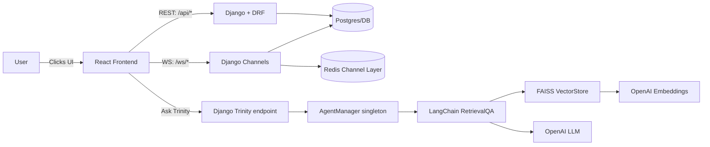
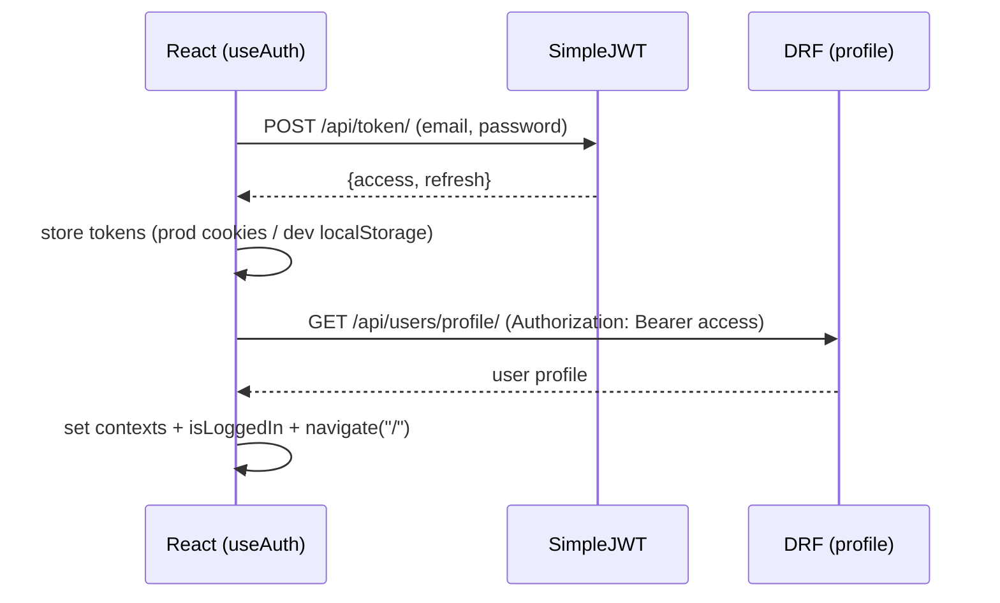
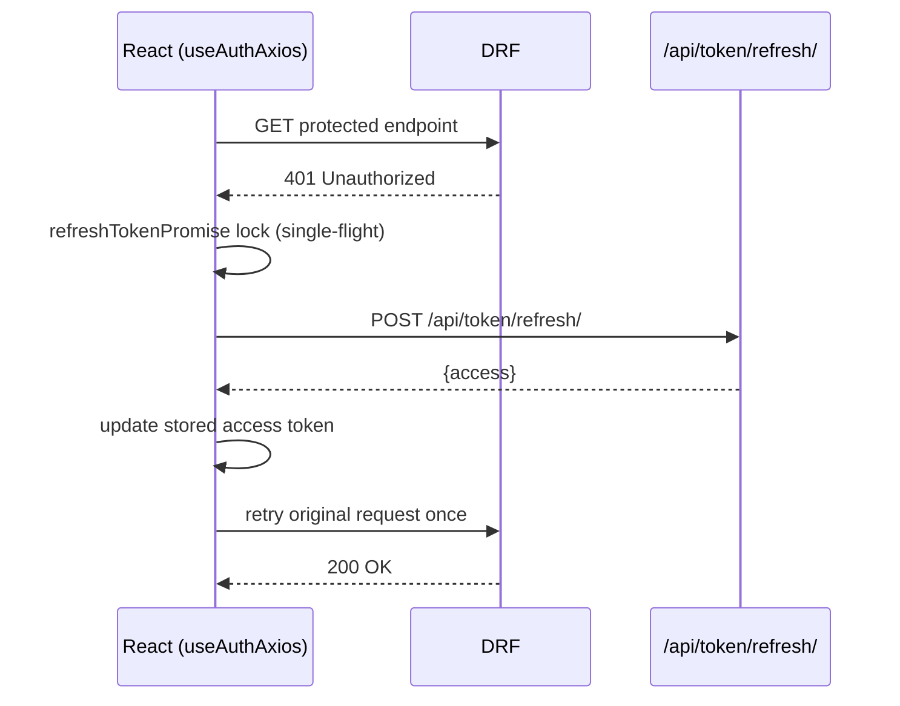
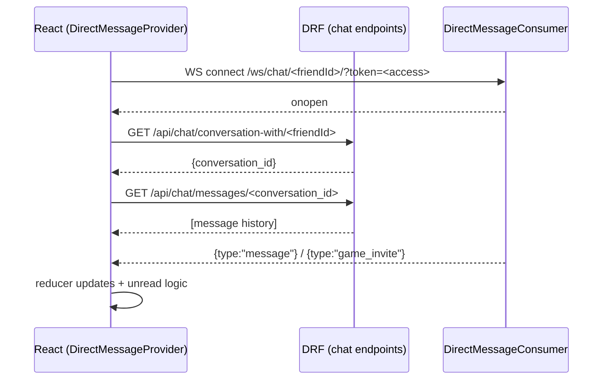
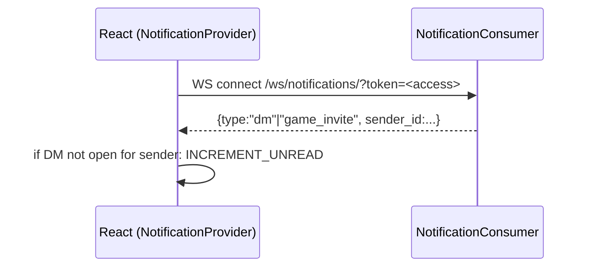
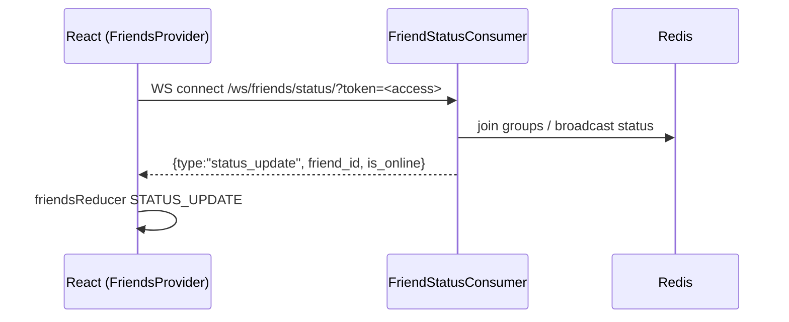
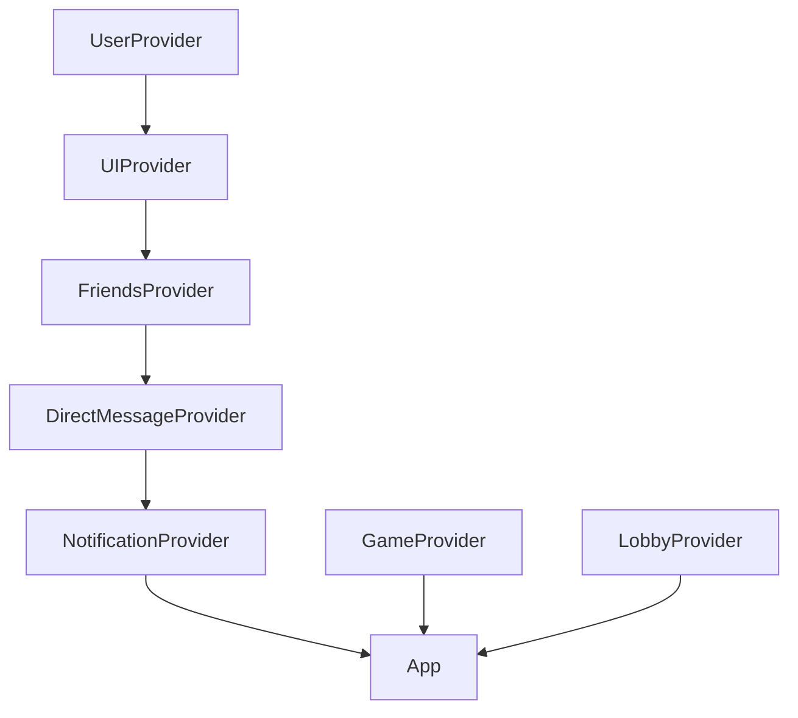

# Full System Guide  
**React + Django/DRF + Channels + Redis + Trinity (RAG Agent)**

> Built and maintained by **Anthony Narine**.  
> Powered by Django, DRF, Channels, Redis, React, and LangChain.

This is a map of the entire system: **frontend + backend**, how they interact, and where to look when something breaks. I built this app to get a deeper understanding of websockets redis and Langchain. 
I chose tic-tac-toe because my daughter enjoys plaing it. i hope she can a few games when she's older. 

- **Backend deep dive:** `docs/BACKEND_MASTER.md`
- **This doc:** cross-system architecture + real module entry points + real-time flows + AI assistant

---

## Table of contents
1. System overview  
2. Live endpoints and environment switching  
3. Exact backend routes (confirmed)  
4. Architecture diagrams (Mermaid)  
5. Frontend architecture (layout + providers + contexts)  
6. Backend architecture (REST + WebSockets)  
7. Core flows (Auth, Presence, Friends, DM, Notifications, Invites, Game, Rematch)  
8. Trinity AI (RAG) architecture + UI flow  
9. Local development runbook  
10. Deployment notes (Netlify manual + ASGI backend)  
11. Troubleshooting checklist  

---

## 1) System overview

### What i built
A real-time multiplayer/social app with:
- **JWT auth** via REST (SimpleJWT)
- **Presence + real-time features** via WebSockets (Channels + Redis)
- **Friends + friend requests + invites**
- **Direct messages (DM)**
  - WebSocket live messages
  - REST preload history
  - Unread badge logic (DM drawer + notifications socket)
- **Game flow**
  - REST-based game state + moves
  - WebSocket rematch signaling (`rematch_request` → offer → start)
- **Trinity AI agent**
  - LangChain RetrievalQA + FAISS over repo/docs
  - Frontend “TrinityDrawer” assistant UI
  - The RAG agent can answer any question about this application. 

### Design principle
- REST = “fetch/store authoritative state”
- WebSockets = “live updates, coordination, unread badges, presence, rematch/offers”

---

## 2) Live endpoints and environment switching (frontend)

The frontend switches URLs based on `NODE_ENV` (see `config.js`).

### REST API base URL
- **Production:** `https://tic-tac-toe-server-66c5e15cb1f1.herokuapp.com/api`
- **Development:** `http://localhost:8000/api`

### WebSocket connectivity
Currently create WS URLs using `REACT_APP_BACKEND_WS` in multiple places:
- Production base: `wss://${REACT_APP_BACKEND_WS}`
- Development base: `ws://localhost:8000`

Then the code appends paths like:
- `/ws/friends/status/`
- `/ws/notifications/`
- `/ws/chat/<friendId>/`

**Recommended production env var**
- `REACT_APP_BACKEND_WS=tic-tac-toe-server-66c5e15cb1f1.herokuapp.com`

> Note: `config.js` also defines `websocketBaseUrl` ending in `/ws`, but your current WS hooks/providers build the base manually. If you later standardize on `config.websocketBaseUrl`, append *paths without a second* `/ws` prefix (example: `${config.websocketBaseUrl}/friends/status/`).

---

## 3) Exact backend routes (confirmed from Django URLConfs)

### 3.1 REST (`urls.py`)
- Users:
  - `/api/users/ ...`
- Friends:
  - `/api/friends/ ...`
- Games:
  - `/api/games/ ...`
- Chat:
  - `/api/chat/ ...`
- Trinity / AI Agent:
  - `/api/trinity/` (mounted via `path("api/", include("ai_agent.urls"))`)
- JWT:
  - `POST /api/token/`
  - `POST /api/token/refresh/`

### 3.2 WebSockets (`routing.py`)
- Friends presence:
  - `/ws/friends/status/`
- Chat lobby:
  - `/ws/chat/lobby/<lobby_name>/`
- Direct messages:
  - `/ws/chat/<friend_id>/`
- Notifications:
  - `/ws/notifications/`
- Game socket:
  - `/ws/game/<game_id>/`

---

## 4) Architecture diagrams 

### 4.1 System overview



### 4.2 Auth flow (login → profile)



### 4.3 Token refresh (single-flight)



### 4.4 Direct messages (REST preload + WS live)



### 4.5 Notifications (global socket → unread badge updates)



### 4.6 Presence (friends online/offline)



---

## 5) Frontend architecture (real entry points)

### 5.1 Layout composition
- **AppShell**
  - Global wrapper for the UI
  - Mounts **TrinityDrawer** globally (not tied to a route)
- **ResponsiveLayout**
  - Desktop: `FriendsSidebar + MainRoutes + DMDrawer`
  - Mobile: FriendsSidebar becomes fullscreen overlay, main content otherwise fills viewport

### 5.2 State architecture (contexts/providers)
Provider-based architecture:
- **UserContext**: user + isLoggedIn + authLoaded
- **UIContext**: global drawers (sidebar, DM, Trinity) + route guards
- **FriendsContext**: friend list + pending requests + presence WS
- **DirectMessageContext**: DM WS + messages by friendId + unread counts + invites
- **NotificationContext**: global notifications WS (unread badges + invites)
- **GameContext / LobbyContext**: gameplay + lobby reducers

Dependency order (mental model):



---

## 6) Backend architecture (high-level)

### 6.1 REST (DRF + SimpleJWT)
Core endpoints:
- `POST /api/token/` → `{ access, refresh }`
- `POST /api/token/refresh/` → `{ access }`
- `GET /api/users/profile/` → user profile (protected)

### 6.2 WebSockets (Channels + Redis)
Core WS routes:
- Presence: `/ws/friends/status/`
- DMs: `/ws/chat/<friend_id>/`
- Lobby chat: `/ws/chat/lobby/<lobby_name>/`
- Notifications: `/ws/notifications/`
- Game: `/ws/game/<game_id>/`

**Critical reminder:** WebSockets require **ASGI**. A `/ws/...` 404 is usually “ASGI routing isn’t active”.

---

## 7) Core flows (frontend ↔ backend)

### 7.1 Friends + pending requests
- Friends sidebar loads friends/pending via REST and refreshes after accept/decline.
- Presence WS pushes `status_update` events that update online indicators.

### 7.2 Direct messages (DM)
- When opening a DM:
  - connect WS to `/ws/chat/<friend_id>/?token=...`
  - optionally preload history via REST
- Incoming messages can increment unread counts if the DM drawer isn’t open for that sender.

### 7.3 Notifications
- A global notification socket keeps unread dots up to date even when no DM socket is open.

### 7.4 Game flow (REST)
- Create: `POST /api/games/` with `{ is_ai_game }`
- Fetch: `GET /api/games/<id>/`
- Move: `POST /api/games/<id>/move/`
- Complete: `POST /api/games/<id>/complete/`

### 7.5 Rematch (WS)
- Client sends: `{ type: "rematch_request" }`
- Server should broadcast:
  - `rematch_offer` (to other player)
  - `rematch_start` (when accepted, includes new game id)

---

## 8) Trinity AI (RAG Agent)

### 8.1 Trinity UI (frontend)
- Global drawer controlled by `UIContext` (`isTrinityOpen`)
- Sends:
  - `POST /api/trinity/` with `{ question }`
- Renders:
  - message history
  - typing animation for AI responses

### 8.2 Trinity backend (high-level)
- Django endpoint receives `{ question }`
- AgentManager builds/reuses RetrievalQA chain:
  - loads files
  - chunks
  - embeds
  - stores in FAISS
  - answers via OpenAI

Operational notes:
- First question is slower (index build)
- Requires `OPENAI_API_KEY` on backend
- Returns `{ answer }` (no citations yet — can be added later)

---

## 9) Local development runbook

### Step 1: Start Redis
```bash
docker run -p 6379:6379 redis:7
```

### Step 2: Run backend (ASGI server)
```bash
uvicorn <project>.asgi:application --host 0.0.0.0 --port 8000 --reload
```

### Step 3: Run frontend
```bash
npm install
npm start   # CRA
```
---

## 10) Deployment notes (Netlify manual + backend)

### 10.1 Netlify manual deploy
- Build locally:
  - `npm run build`
- Upload artifacts:
  - CRA: `build/`
  - Vite: `dist/`

### 10.2 Backend
- Must run ASGI (uvicorn/daphne) for WebSockets.
- Redis must be reachable for channel layer.

---

## 11) Troubleshooting checklist

### A) `/ws/...` 404
- **Cause:** running WSGI-only / ASGI routing not active
- **Fix:** run uvicorn/daphne targeting `<project>.asgi:application`

### B) Login succeeds but profile 401
- **Cause:** Authorization header missing
- **Fix:** inspect axios request interceptor + token storage retrieval

### C) Infinite refresh loop
- **Cause:** refresh logic catches public endpoints or refresh endpoint
- **Fix:** confirm public allowlist + `skipAuth` usage

### D) Presence/DM/notifications not connecting in production
- **Cause:** `REACT_APP_BACKEND_WS` missing or incorrect in Netlify build env
- **Fix:** set `REACT_APP_BACKEND_WS=tic-tac-toe-server-66c5e15cb1f1.herokuapp.com`

### E) Trinity 500
- **Cause:** missing `OPENAI_API_KEY` or indexing path issues
- **Fix:** check backend logs; confirm env + indexing directories

