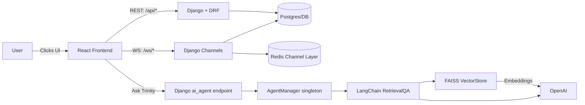
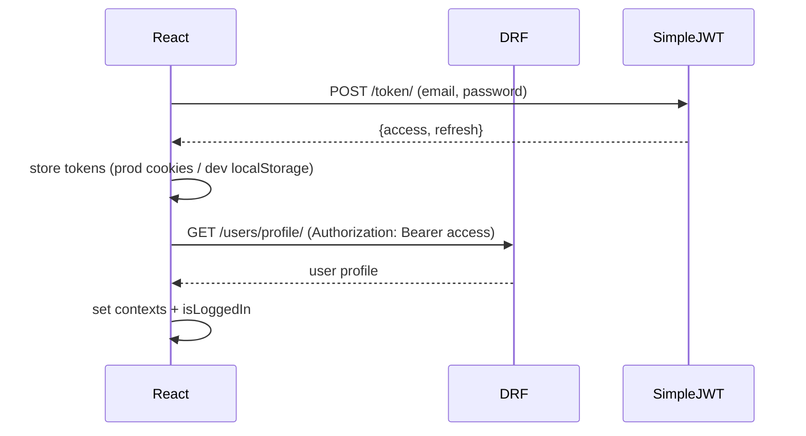
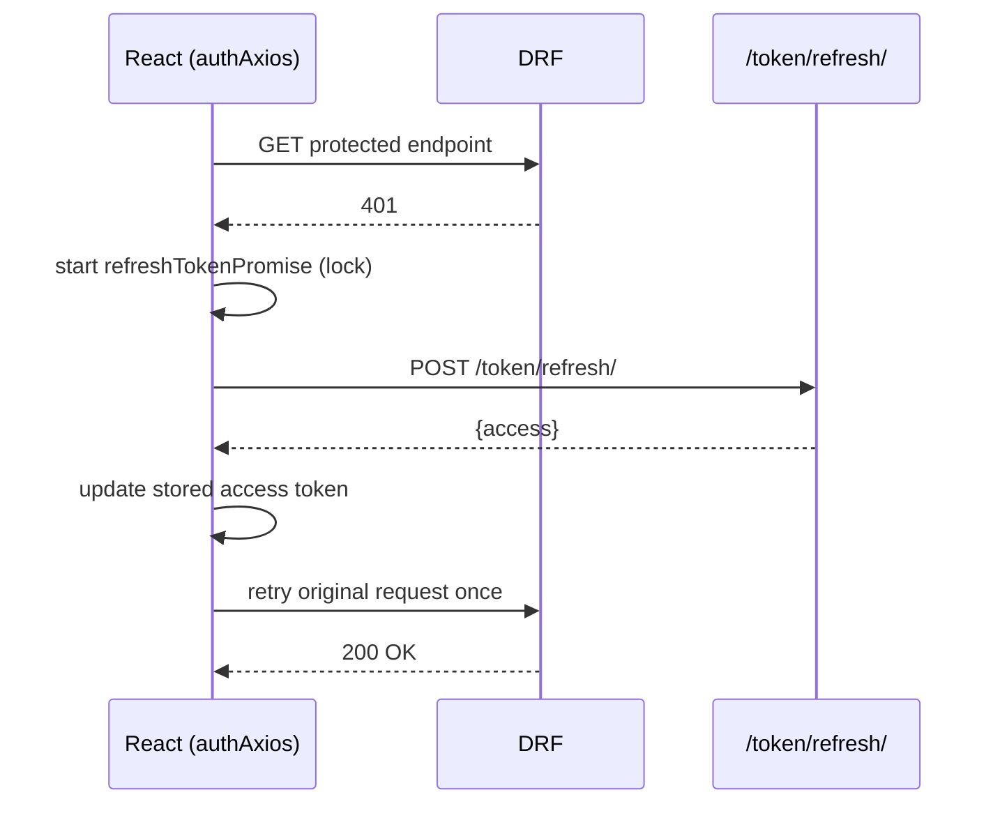
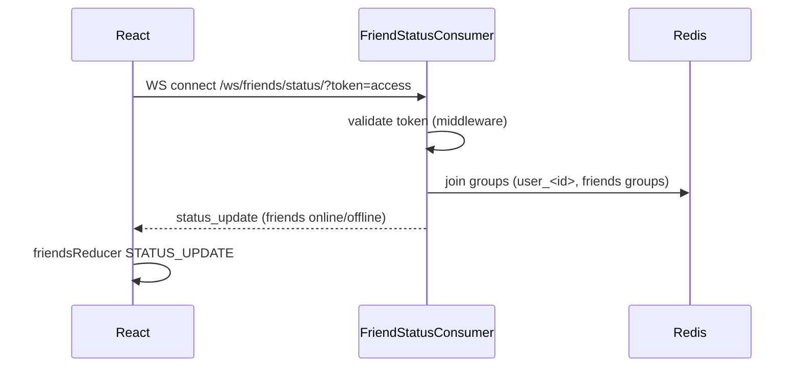
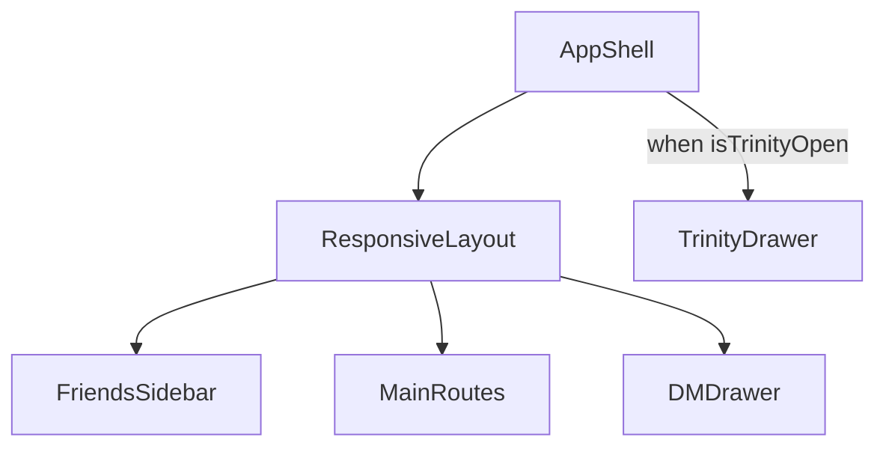
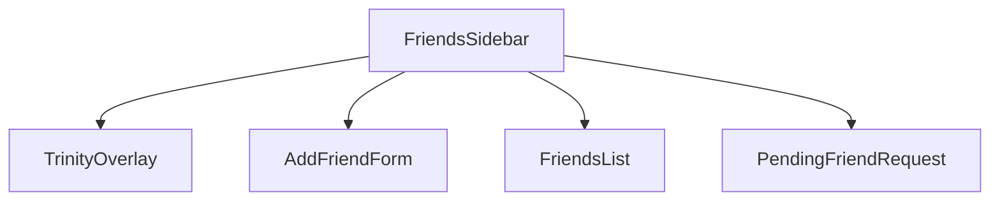

# PROJECT_MASTER.md — Full-Stack System Guide  
**React + Django/DRF + Channels + Redis + Trinity (RAG Agent)**

This document is the “map of the universe” for the whole project: **frontend + backend**, how they interact, and where to look when something breaks.

---

## Table of contents
1. System overview  
2. Live endpoints and environment switching  
3. Architecture diagrams  
4. Frontend architecture  
5. Backend architecture  
6. Core flows (Auth, Presence, Friends, Invites, Game, Rematch)  
7. Trinity AI (RAG) architecture + flow  
8. Local development runbook  
9. Deployment notes (Netlify manual + ASGI backend)  
10. Troubleshooting checklist  
11. Optional files that would make docs even tighter  

---

## 1) System overview

**What you built**
- A real-time multiplayer/social app with:
  - **JWT auth** via REST (SimpleJWT)
  - **Presence + real-time features** via WebSockets (Channels + Redis)
  - **Friends + friend requests + invites**
  - **Game flow** (REST game state + move calls, plus WS rematch signaling)
  - **Trinity AI agent** (LangChain RetrievalQA + FAISS over repo/docs)

**Key design principle**
- REST = “fetch/store authoritative state”
- WebSockets = “live updates, coordination, notifications, rematch/offers, presence”

---

## 2) Live endpoints and environment switching (from `config.js`)

Your frontend switches URLs based on `NODE_ENV`:

### REST API base URL
- **Production:** `https://tic-tac-toe-server-66c5e15cb1f1.herokuapp.com/api`
- **Development:** `http://localhost:8000/api`

### WebSocket base URL
- **Production:** `wss://tic-tac-toe-server-66c5e15cb1f1.herokuapp.com/ws`
- **Development:** `ws://localhost:8000/ws`

### Access token retrieval
- **Production:** `Cookies.get("access_token")`
- **Development:** `localStorage.getItem("access_token")`

> Note: one WS hook (`useFriendStatusSocket`) currently uses `REACT_APP_BACKEND_WS` host + hardcoded `/ws/...` path. Documented below.

---

## 3) Architecture diagrams

### 3.1 System overview (Flowchart)



### 3.2 Auth flow (Sequence)



### 3.3 Token refresh (single-flight) — what you fixed



### 3.4 Presence socket (WebSocket)



---

## 4) Frontend architecture (what renders what)

### 4.1 Layout composition (real modules)

- `AppShell.jsx`
  - Wraps the entire UI
  - Mounts **TrinityDrawer** globally (outside sidebar tree)
- `ResponsiveLayout.jsx`
  - Desktop: `FriendsSidebar + MainRoutes + DMDrawer`
  - Mobile: sidebar becomes fullscreen overlay

**Layout diagram**



### 4.2 Friends sidebar UX map

`FriendsSidebar.jsx` renders:
- TrinityOverlay “launcher”
- AddFriendForm
- Friends list (online/offline, unread badge, invite button)
- Pending requests list (accept/decline)



**Interaction rules**
- Clicking a friend row opens DM **only if online**
- Invite button appears **only if online**
- Pending request actions call accept/decline then refresh list

---

## 5) Backend architecture (how the server is composed)

### 5.1 REST (DRF + SimpleJWT)
- Tokens: `/token/`, `/token/refresh/`
- Protected profile: `/users/profile/`
- Game APIs: `/games/`, `/games/<id>/`, `/games/<id>/move/`, `/games/<id>/complete/` *(exact depends on backend router; frontend expects these paths)*

### 5.2 WebSockets (Channels + Redis)
- All WS routes live under `/ws/...`
- Redis is the channel layer that allows group broadcasts across workers/instances
- **ASGI is required** — a 404 on `/ws/...` is usually “ASGI routing wasn’t active”

---

## 6) Core flows (frontend ↔ backend)

### 6.1 Friends list + unread + invite
**Component:** `FriendsList.jsx`  
- `unreadCounts[friendUserId] > 0` → shows a badge (dot)  
- if friend is online → shows invite button  
- clicking row opens DM (online only)

### 6.2 Friend requests: accept / decline
**Components:**  
- `PendingFriendRequest.jsx` renders a request row with accept/decline buttons  
- `FriendsSidebar.jsx` wires handlers:
  - `acceptRequest(id)` → `refreshFriends()`
  - `declineRequest(id)` → `refreshFriends()`

### 6.3 Game load + moves + finalize
**Modules involved**
- `GamePage.jsx` loads `gameId` from route param and renders the game via `GameManager` render-prop.
- `GameManager.jsx` does:
  - `fetchGame(gameId)` on mount
  - `makeMove(gameId, cellIndex)` when a cell is clicked (validity checks)
  - calls `finalizeGame(...)` once when game ends (guarded by a ref)

**Turn validation (frontend)**
- `GamePage` derives `playerRole` and disables interaction when it’s not your turn.

### 6.4 Rematch (multiplayer)
- `GameManager.requestRematch()` sends WS message:
  - `{ type: "rematch_request" }`
- The backend is expected to broadcast:
  - `rematch_offer` to the other player
  - `rematch_start` when accepted (new game id)

---

## 7) Trinity AI (RAG Agent)

### 7.1 What it is
A Django app that exposes an endpoint (via DRF APIView) to answer questions about the project by:
- loading repo files (with filters)
- chunking text
- embedding with OpenAI
- storing vectors in FAISS
- answering via LangChain `RetrievalQA`

### 7.2 Runtime lifecycle (singleton)
- `AgentManager` builds the agent **once** on first request (thread-safe lock)
- subsequent calls reuse the in-memory chain

### 7.3 What gets indexed
- In **DEBUG**, it includes backend apps *and selected frontend folders* (components/reducers/context)
- In **production**, it focuses on backend apps

### 7.4 Endpoint note
Your `AskAgentView` expects JSON:
```json
{ "question": "..." }
```
and returns:
```json
{ "answer": "..." }
```

The exact URL path is defined in the backend router (commonly `/trinity/` relative to the API prefix). If you want this doc to state the exact final URL, include `ai_agent/urls.py` in the docs folder.

---

## 8) Local development runbook

### Step 1: Start Redis
```bash
docker run -p 6379:6379 redis:7
```

### Step 2: Run backend (ASGI server)
Use one of:
```bash
uvicorn <project>.asgi:application --host 0.0.0.0 --port 8000 --reload
```
or
```bash
daphne -b 0.0.0.0 -p 8000 <project>.asgi:application
```

### Step 3: Run frontend
```bash
npm install
npm start   # CRA
# or
npm run dev # Vite
```

---

## 9) Deployment notes (Netlify manual + backend)

### 9.1 Netlify manual deploy
- Build locally:
  - `npm run build`
- Upload artifacts:
  - CRA: `build/`
  - Vite: `dist/`

### 9.2 Important: WS host mismatch to be aware of
- `config.js` defines `websocketBaseUrl`
- `useFriendStatusSocket` uses `REACT_APP_BACKEND_WS || "localhost:8000"`

If `REACT_APP_BACKEND_WS` is not set in Netlify, presence WS will try to connect to localhost in production.

**Recommended fix (future):**
- update the presence hook to use `config.websocketBaseUrl` so all WS routes use the same source of truth.

---

## 10) Troubleshooting checklist

### A) `/ws/...` 404
- **Cause:** running WSGI server / ASGI not active
- **Fix:** run uvicorn/daphne targeting `<project>.asgi:application`

### B) Login succeeds but profile 401
- **Cause:** Authorization header missing
- **Fix:** inspect `useAuthAxios` request interceptor + token storage retrieval

### C) Infinite refresh loop
- **Cause:** refresh logic intercepts public endpoints or refresh endpoint
- **Fix:** confirm public allowlist + `skipAuth` usage

### D) Presence not updating
- **Cause:** token missing/expired OR WS host mismatch
- **Fix:** verify `REACT_APP_BACKEND_WS` in prod, and token retrieval in cookies/localStorage

### E) Rematch doesn’t work
- **Cause:** WS provider not connected to the game socket, or server doesn’t broadcast expected message types
- **Fix:** capture WS frames in browser devtools and confirm `rematch_offer/rematch_start` payloads

### F) Trinity returns 500
- **Cause:** missing `OPENAI_API_KEY` or indexing path issues
- **Fix:** check server logs; confirm directories exist (debug logs already print path checks)

---

## 11) Optional files that would make docs even tighter (not required)

You said this is the last dump — and you *do* have enough for a strong master doc.

If you ever want it to be **100% repo-perfect**, the top add-ons are:

### Frontend
- `MainRoutes.jsx` / route map (to document recruiter click paths exactly)
- `TrinityDrawer.jsx` (to document the Trinity UI flow and UX)
- `DMDrawer.jsx` + direct message socket wiring (to document DM WS routes and events)
- Contexts:
  - `uiContext`, `userContext`, `friendsContext`, `directMessageContext`, `GameWebsocketContext`
- WebSocket routing/actions file (where `data.type` is handled)

### Backend
- `urls.py` (project + ai_agent) to lock exact endpoint paths in documentation
- `routing.py` per app (to list exact WS URL patterns)
