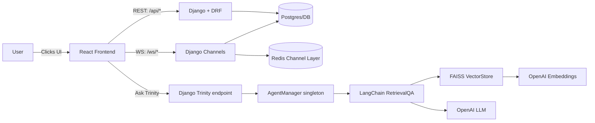
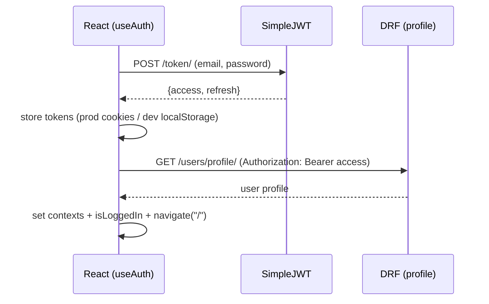
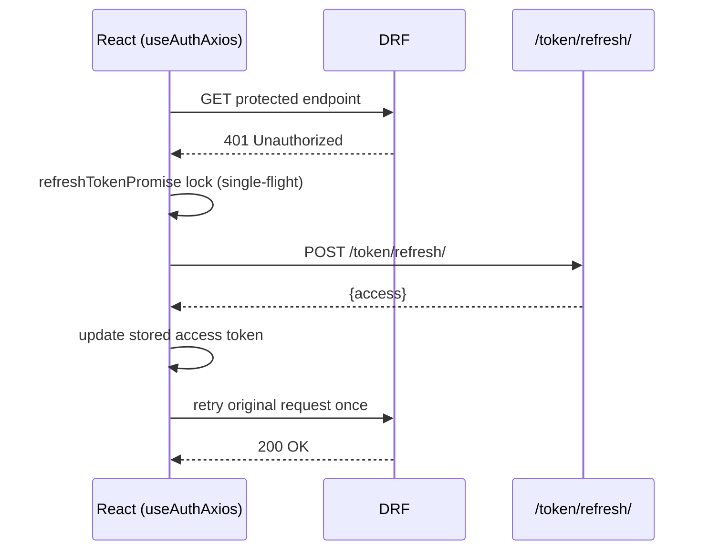
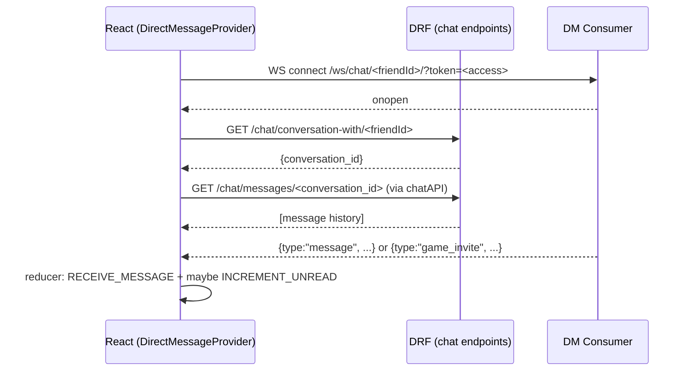
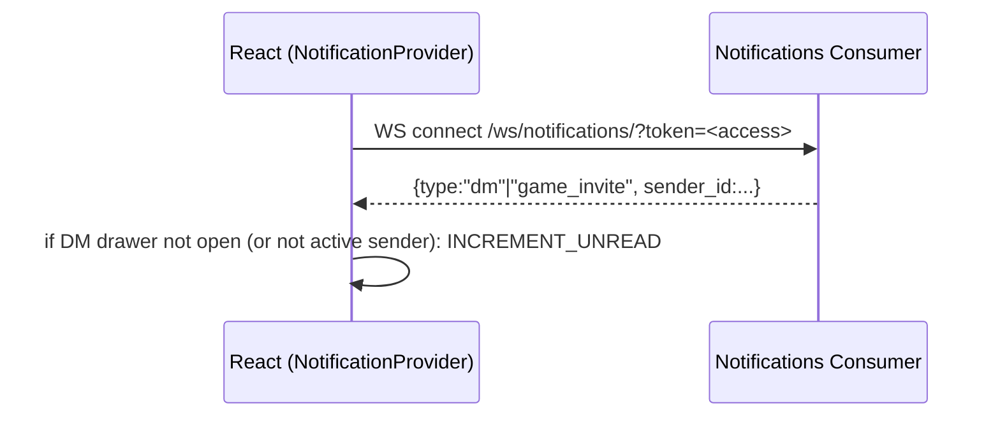
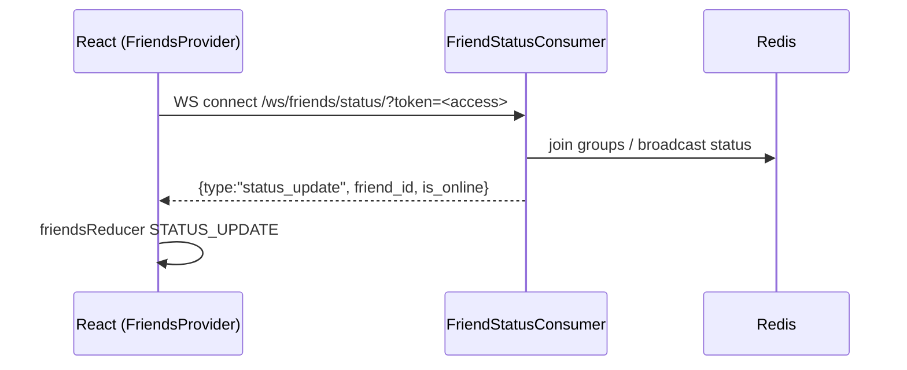
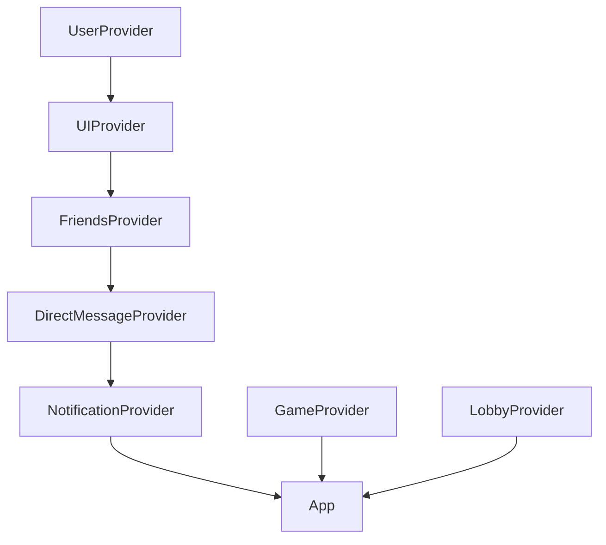
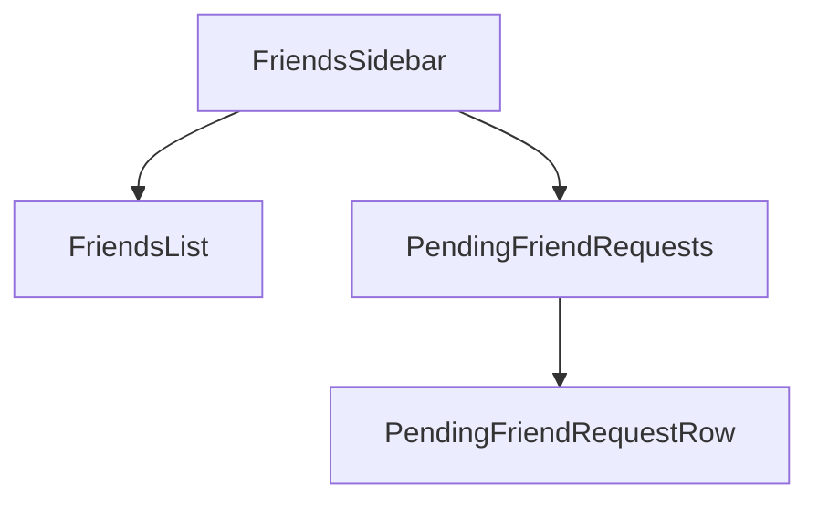

Built and maintained by **Anthony Narine**.  
Powered by Django, DRF, Channels, Redis, React, and LangChain.

# Full System Guide  
**React + Django/DRF + Channels + Redis + Trinity (RAG Agent)**

This is the single, recruiter-friendly map of the entire system: **frontend + backend**, how they interact, and where to look when something breaks.

- **Backend deep dive:** see `docs/BACKEND_MASTER.md`
- **This doc:** cross-system architecture + real module entry points + real-time flows + AI assistant

---

## Table of contents
1. System overview  
2. Live endpoints and environment switching  
3. Architecture diagrams (Mermaid)  
4. Frontend architecture (layout + providers + contexts)  
5. Backend architecture (REST + WebSockets)  
6. Core flows (Auth, Presence, Friends, DM, Notifications, Invites, Game, Rematch)  
7. Trinity AI (RAG) architecture + UI flow  
8. Local development runbook  
9. Deployment notes (Netlify manual + ASGI backend)  
10. Troubleshooting checklist  
11. Optional files for “100% exact” docs  

---

## 1) System overview

### What you built
A real-time multiplayer/social app with:
- **JWT auth** via REST (SimpleJWT)
- **Presence + real-time features** via WebSockets (Channels + Redis)
- **Friends + friend requests + invites**
- **Direct messages (DM)**
  - WebSocket live messages
  - REST preload history
  - Unread badge logic
- **Game flow**
  - REST-based game state + moves
  - WebSocket rematch signaling (request/offer/start)
- **Trinity AI agent**
  - LangChain RetrievalQA + FAISS over repo/docs
  - Frontend “TrinityDrawer” assistant UI

### Design principle
- REST = “fetch/store authoritative state”
- WebSockets = “live updates, coordination, unread badges, presence, rematch/offers”

---

## 2) Live endpoints and environment switching (from `config.js`)

Your frontend switches URLs based on `NODE_ENV`.

### REST API base URL
- **Production:** `https://tic-tac-toe-server-66c5e15cb1f1.herokuapp.com/api`
- **Development:** `http://localhost:8000/api`

### WebSocket base URL (declared in config)
- **Production:** `wss://tic-tac-toe-server-66c5e15cb1f1.herokuapp.com/ws`
- **Development:** `ws://localhost:8000/ws`

### Access token retrieval (declared in config)
- **Production:** `Cookies.get("access_token")`
- **Development:** `localStorage.getItem("access_token")`

> Important: some WS hooks/providers currently use `REACT_APP_BACKEND_WS` and build `WS_BASE` manually instead of using `config.websocketBaseUrl`. That’s documented in “WebSockets”.

---

## 3) Architecture diagrams (Mermaid)

### 3.1 System overview (flowchart)



---

### 3.2 Auth flow (sequence)



---

### 3.3 Token refresh (single-flight lock)



---

### 3.4 Direct messages (REST preload + WS live updates)



---

### 3.5 Notifications (global socket → unread badge updates)



---

### 3.6 Presence socket (friends online/offline)



---

## 4) Frontend architecture (real entry points)

### 4.1 Layout composition

**AppShell**
- Global wrapper for the app UI
- Mounts **TrinityDrawer** globally (not tied to a route)

**ResponsiveLayout**
- Desktop:
  - FriendsSidebar always visible
  - main routes in center
  - DMDrawer slides in and can shift layout
- Mobile:
  - FriendsSidebar becomes fullscreen overlay
  - main content otherwise fills the viewport

**Layout composition diagram**

```mermaid
flowchart TB
  AppShell --> ResponsiveLayout
  ResponsiveLayout --> FriendsSidebar
  ResponsiveLayout --> MainRoutes[MainRoutes (not provided)]
  ResponsiveLayout --> DMDrawer
  AppShell -->|isTrinityOpen| TrinityDrawer
```

---

### 4.2 Provider / context tree (how state is organized)

You have a “provider-based architecture”:
- **UserContext**: user + isLoggedIn + authLoaded
- **UIContext**: global drawers (sidebar, DM, Trinity) with route guards
- **FriendsContext**: friend list + pending requests + presence WS
- **DirectMessageContext**: DM WS + message storage + unread counts + invite send
- **NotificationContext**: global notification WS (unread badges + invites)
- **GameContext / LobbyContext**: reducers for gameplay + lobby state

**Suggested provider wrapping order (mental model)**



> Your actual wrapping may differ, but the dependencies are real:  
> `FriendsProvider`, `DirectMessageProvider`, `NotificationProvider` all depend on `UserContext`, and some depend on `UIContext`.

---

### 4.3 Friends sidebar UX map

**FriendsSidebar**
- Renders “TrinityOverlay” launcher
- Contains:
  - Friends list (online/offline, unread dot, invite button)
  - Pending friend requests (accept/decline)
  - Add friend form (if present)



---

## 5) Backend architecture (high-level)

### 5.1 REST (DRF + SimpleJWT)
The frontend expects these core endpoints (resolved under `config.apiBaseUrl`):
- `POST /token/` → `{ access, refresh }`
- `POST /token/refresh/` → `{ access }`
- `GET /users/profile/` → user profile (protected)

Game REST calls observed in frontend:
- `POST /games/` with `{ is_ai_game: true|false }`
- `GET /games/<id>/`
- `POST /games/<id>/move/`
- `POST /games/<id>/complete/`

### 5.2 WebSockets (Channels + Redis)
Core WS routes used by the frontend:
- Presence: `/ws/friends/status/`
- DMs: `/ws/chat/<friendId>/`
- Notifications: `/ws/notifications/`
- Game WS: (used for rematch signals; exact route depends on backend routing)

**Critical reminder:** WebSockets require ASGI. A `/ws/...` 404 is usually “ASGI routing isn’t active”.

---

## 6) Core flows (frontend ↔ backend)

### 6.1 Auth boot (login → profile → app state)
- Login (`useAuth`) calls `/token/`, stores tokens
- Immediately fetches `/users/profile/`
- Sets contexts + navigates to home

**Where to debug**
- Authorization header missing: `useAuthAxios` request interceptor
- Refresh loops: `useAuthAxios` response interceptor

---

### 6.2 Friends: REST + presence WS
**FriendsProvider responsibilities**
- Opens presence socket via `useFriendStatusSocket(user, dispatch)`
- Loads friends and pending requests via REST:
  - `fetchFriends()`
  - `fetchPending()`
- Accept/decline triggers refresh

**Presence**
- WS message type: `status_update` (frontend expects this)
- Reducer action: `STATUS_UPDATE`

---

### 6.3 Direct messages: REST preload + WS send/receive
**DirectMessageProvider**
- Opens a DM socket to a specific friend:
  - `/ws/chat/<friendId>/?token=<access>`
- Preloads message history (optional):
  1) `GET /chat/conversation-with/<friendId>`
  2) `GET conversation messages` via `chatAPI.fetchConversationMessages(...)`

**Live WS messages handled**
- `type: "message"`
- `type: "game_invite"`

**Unread logic**
- If a message is received and:
  - receiver is current user, and
  - DM drawer is closed OR activeFriendId isn’t the sender  
  → dispatch `INCREMENT_UNREAD`.

---

### 6.4 DM drawer UX (how it renders messages)
**DMDrawer**
- Only renders when `isOpen && activeChat`  
- Determines `friendId` from `activeChat` and current `user.id`
- Renders messages from `messages[friendId]`
- Send message:
  - `sendMessage(newMessage)`
- Invite to game:
  - uses `useInviteAndNotifyFriend()` to send invite + DM link, then navigate

---

### 6.5 Notifications: global unread badge channel
**NotificationProvider**
- Opens one socket for the whole user:
  - `/ws/notifications/?token=<access>`
- On message:
  - if `type` is `"dm"` or `"game_invite"`
  - and DM drawer is not already open with that user  
  → increments unread for that sender

**Why this exists**
- You get “unread dot updates” even when a DM socket isn’t open.

---

### 6.6 Game creation + game loop (REST)
**Create game**
- `POST /games/` payload: `{ is_ai_game }`

**GameManager**
- Loads `gameId` from params (via GamePage)
- Fetches game on mount
- Validates turns
- Sends moves and finalizes game once when complete

**Winner calculation**
- `WinnerCalculator` determines winner/draw and winning combination

---

### 6.7 Multiplayer result + rematch (WS + UI)
**MultiplayerResultModal / GameManager**
- Sends WS message: `{ type: "rematch_request" }`
- Expects server events like:
  - `rematch_offer` (to other player)
  - `rematch_start` (when accepted, includes new game id/lobby id)

**Countdown**
- `useCountdown(10, ...)` used for “waiting” UX while rematch offer pending

---

## 7) Trinity AI (RAG Agent)

### 7.1 Trinity UI (frontend)
**TrinityDrawer**
- Global drawer controlled by `UIContext`:
  - `isTrinityOpen`, `setTrinityOpen(...)`
- Uses `authAxios` to call:
  - `POST "/trinity/"` with `{ question }` (relative to API base URL)
- Renders message history with a typing animation effect for the AI response

**Route safety**
- `UIContext` automatically closes Trinity on restricted routes:
  - `/technical-paper`
  - `/games/*`
  - `/lobby/*`

---

### 7.2 Trinity backend (high-level)
- Django endpoint receives `{ question }`
- `AgentManager` builds/reuses a RetrievalQA chain:
  - loads files
  - chunks
  - embeds
  - indexes in FAISS
  - answers via OpenAI LLM

**Operational notes**
- First question is slower (index build)
- Requires `OPENAI_API_KEY` on backend
- Currently returns `{ answer }` without citations (add sources later if desired)

---

## 8) Local development runbook

### Step 1: Start Redis
```bash
docker run -p 6379:6379 redis:7
```

### Step 2: Run backend (ASGI server)
```bash
uvicorn <project>.asgi:application --host 0.0.0.0 --port 8000 --reload
# or
daphne -b 0.0.0.0 -p 8000 <project>.asgi:application
```

### Step 3: Run frontend
```bash
npm install
npm start   # CRA
# or
npm run dev # Vite
```

---

## 9) Deployment notes (Netlify manual + backend)

### 9.1 Netlify manual deploy
- Build locally:
  - `npm run build`
- Upload artifacts:
  - CRA: `build/`
  - Vite: `dist/`

### 9.2 Important: WS base URL consistency
- `config.js` defines `websocketBaseUrl`
- Some WS code uses `REACT_APP_BACKEND_WS` + hardcoded `/ws/...`

**Recommended improvement**
- Centralize WS base URL usage:
  - update WS providers/hooks to use `config.websocketBaseUrl` consistently

---

## 10) Troubleshooting checklist

### A) `/ws/...` 404
- **Cause:** running WSGI-only / ASGI routing not active
- **Fix:** run uvicorn/daphne targeting `<project>.asgi:application`

### B) Login succeeds but profile 401
- **Cause:** Authorization header missing (token attach issue)
- **Fix:** inspect `useAuthAxios` request interceptor + token storage

### C) Infinite refresh loop
- **Cause:** refresh logic incorrectly catches public endpoints or refresh endpoint
- **Fix:** confirm public allowlist + `skipAuth` usage

### D) Presence not updating
- **Cause:** token missing/expired OR WS host mismatch
- **Fix:** verify `REACT_APP_BACKEND_WS` and token retrieval in cookies/localStorage

### E) DM unread dots not behaving
- **Cause:** DM socket + Notification socket both incrementing in edge cases
- **Fix:** confirm whether backend sends both DM socket events and notification “dm” events; decide which should own unread

### F) Trinity returns 500
- **Cause:** missing `OPENAI_API_KEY` or indexing path issues
- **Fix:** check server logs; confirm directory path config + file filters

---

## 11) Optional files for “100% exact” docs
You now provided the most important frontend files. If you ever want the doc to name *exact routes and exact API paths* without any assumptions, add:

### Frontend
- `MainRoutes.jsx` (or route map) → so recruiter click paths can list exact URLs/screens

### Backend
- Project `urls.py` + `ai_agent/urls.py` → locks the exact Trinity endpoint path
- App `routing.py` for chat/friends/game/notifications → locks exact WS patterns
