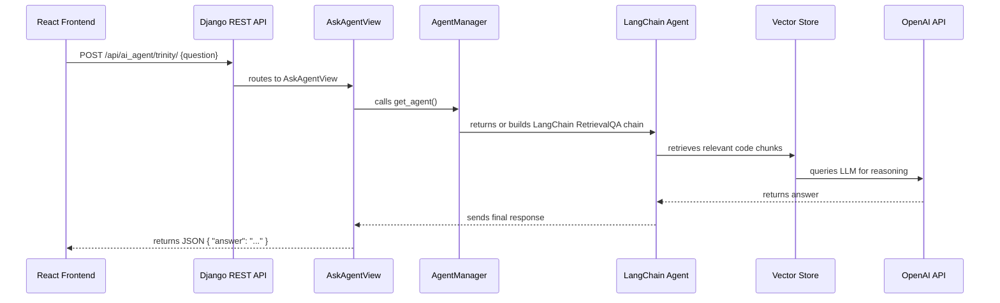

# 🧠 OneVOne AI Agent — Overview

## 📘 Purpose
The **OneVOne AI Agent** module integrates a LangChain-powered Retrieval-QA system into your Django-based Tic-Tac-Toe platform.  
It allows users to ask natural language questions about the project, codebase, or gameplay — and get intelligent responses.

---

## ⚙️ Architecture Overview



---

## 🧩 App Components

| File | Description |
|------|--------------|
| `langchain_agent.py` | Builds the LangChain RetrievalQA pipeline using FAISS embeddings. |
| `agent_manager.py` | Manages a single shared agent instance with thread-safe locking. |
| `views.py` | Defines `AskAgentView`, the REST endpoint that handles user questions. |
| `urls.py` | Registers the `/trinity/` endpoint for routing. |

---

## 🔑 Environment Setup

Add your OpenAI key and Django settings:
```bash
OPENAI_API_KEY=sk-xxxxx
DJANGO_SETTINGS_MODULE=backend.settings
DEBUG=True
```

Install dependencies:
```bash
pip install langchain langchain-community openai faiss-cpu django djangorestframework
```

---

## 🧠 Flow Summary

```
Frontend → Django → LangChain → FAISS → OpenAI → Response
```

- **Frontend** sends POST to `/trinity/`
- **Backend** (Django) receives via `AskAgentView`
- **LangChain agent** searches the codebase (via FAISS)
- **OpenAI LLM** generates contextual response

---

## 💡 Developer Insights

- **FAISS** enables fast semantic retrieval across project files.
- **Thread-safe agent management** prevents unnecessary API calls.
- **RetrievalQA** provides a lightweight but powerful way to query structured codebases.

---
