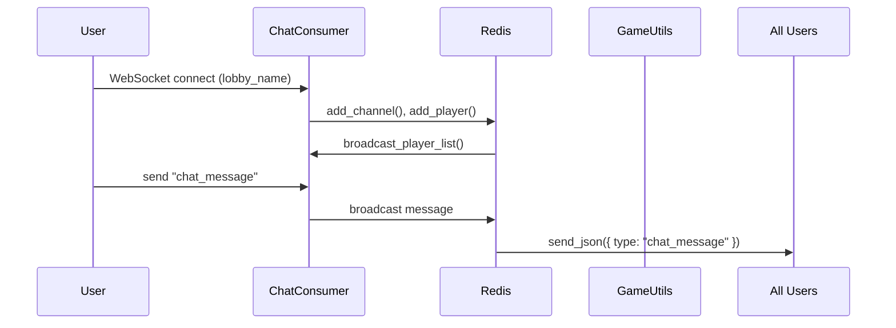

# 🧩 Module: chat_consumer.py

## 📘 Purpose
Manages **real-time chat** for multiplayer lobbies.  
Each WebSocket connection corresponds to a player in a specific game lobby.

---

## ⚙️ Responsibilities
- Authenticate user via JWT in WebSocket scope.
- Join/leave Redis-backed lobby rooms.
- Broadcast chat messages, player list updates, and game start events.
- Coordinate with `GameConsumer` and `RedisChatLobbyManager` for lobby lifecycle.

---

## 🔄 Lifecycle Flow

---

## 🧱 Key Methods

| Method | Description |
|--------|--------------|
| `connect()` | Authenticates user and joins lobby group. |
| `receive_json()` | Handles incoming message types (chat, join, start, leave). |
| `handle_chat_message()` | Broadcasts validated chat messages. |
| `handle_start_game()` | Initializes new game session when 2 players are ready. |
| `disconnect()` | Cleans up Redis state and notifies remaining players. |

---

## 💡 Developer Insights
- All Redis operations handled through **RedisChatLobbyManager**.
- Fully synchronized with Django Channels group system.
- Designed to support horizontal scaling across multiple ASGI workers.

---
