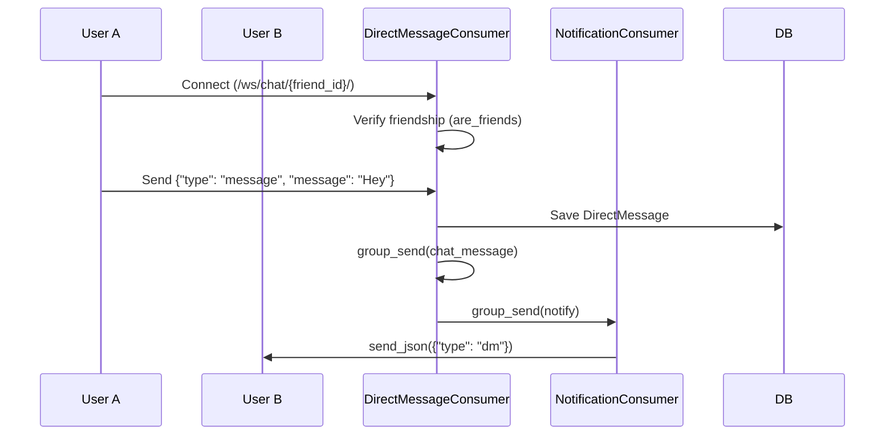

# 🧩 Module: direct_message_consumer.py

## 📘 Purpose
Handles **private 1-on-1 WebSocket chats** between accepted friends.  
Also supports in-chat **game invites** and real-time badge notifications.

---

## ⚙️ Responsibilities
- Authenticate both users and validate friendship.
- Create or reuse a conversation thread.
- Save messages to `DirectMessage` model.
- Notify receiver via `NotificationConsumer`.

---

## 🔄 Flow Diagram

---

## 🧱 Core Methods

| Method | Description |
|--------|-------------|
| `connect()` | Authenticates and verifies friendship. |
| `receive()` | Handles chat messages and game_invite payloads. |
| `chat_message()` | Sends DM event to both users’ WebSocket clients. |
| `game_invite()` | Notifies friend to join game lobby. |
| `save_message()` | Persists message to database. |
| `are_friends()` | Ensures mutual friendship before allowing connection. |

---

## 💡 Developer Insights
- Deterministic group naming ensures both users share same room (`dm_<small_id>__<large_id>`).
- Decoupled design allows DMs even if notification socket is disconnected.
- Uses dual broadcast pattern: one for chat, one for notifications.

---
