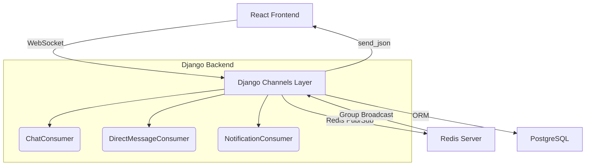

# 💬 OneVOne Chat System — Overview

## 🧠 Purpose
The **OneVOne Chat System** powers real-time multiplayer communication for both **game lobbies** and **private direct messages**.  
It integrates **Django Channels**, **Redis**, and **PostgreSQL** to support persistent, secure, and scalable real-time interactions.

---

## ⚙️ Architecture Overview



---

## 🔄 System Flow Summary

| Module | Responsibility |
|--------|----------------|
| **ChatConsumer** | Manages multiplayer lobby chat, player join/leave, and broadcasts. |
| **DirectMessageConsumer** | Handles private friend DMs, message persistence, and game invites. |
| **NotificationConsumer** | Sends real-time badge and toast updates for DMs, invites, and alerts. |
| **Models** | Stores `DirectMessage` and `Conversation` data for persistence. |
| **Serializer** | Provides REST endpoints to fetch conversation history. |
| **Routing / URLs** | Registers both WebSocket and REST endpoints. |

---

## 🧩 Stack Dependencies

```bash
pip install channels channels-redis djangorestframework
```

**settings.py**
```python
ASGI_APPLICATION = "backend.asgi.application"

CHANNEL_LAYERS = {
    "default": {
        "BACKEND": "channels_redis.core.RedisChannelLayer",
        "CONFIG": {
            "hosts": [("127.0.0.1", 6379)],
        },
    },
}
```

---

## 🧱 Data Flow

```
Frontend (React)
   ↓
WebSocket → ChatConsumer / DirectMessageConsumer
   ↓
Redis → Message broadcast
   ↓
NotificationConsumer → Real-time alerts
   ↓
Database (DirectMessage, Conversation)
```

---

## 💡 Developer Insights
- Uses **Redis** as a shared pub/sub system for horizontal scaling.
- Combines **WebSocket + REST** for persistence and reconnection safety.
- Supports **modular scalability** — future group chats or AI notifications can plug in easily.

---
