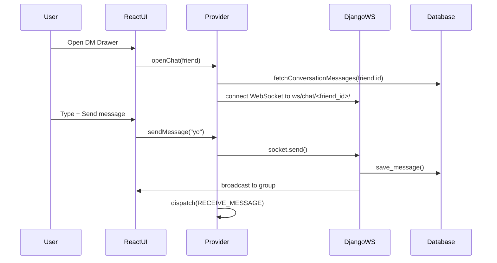

# 📡 Direct Messaging Architecture (v1.0)

This document outlines how the 1-on-1 direct messaging system is architected using Django, Django Channels, Redis, and React.

---

## 🧠 High-Level Overview

| Layer        | Technology/Component     | Purpose                                       |
|--------------|--------------------------|-----------------------------------------------|
| Frontend     | React + Context API      | UI for chatting, managing WebSocket state     |
| State Mgmt   | DirectMessageProvider    | Manages socket, messages, unread, loading     |
| Transport    | WebSocket + REST         | Real-time messaging & historical fetching     |
| Backend      | Django + Channels        | Routing, auth, saving messages, broadcasting  |
| DB Models    | Conversation + Message   | Stores all user messages and relationships    |

---

## 🔁 Message Lifecycle (Sequence Diagram)

---

## ⚙️ REST API: Message History

- **Endpoint**: `/chat/conversations/<id>/messages/`
- **Method**: GET
- **Use**: Fetch past messages when opening a DM drawer
- **Permissions**: Only conversation participants can access

---

## 🌐 WebSocket: Real-Time Messaging

- **Connect To**: `ws://localhost:8000/ws/chat/<friend_id>/`
- **Group Name**: `dm_<id1>__<id2>` (deterministic)
- **Supported Events**:
  - `message`: sends a chat message
  - `game_invite`: invites friend to a game

---

## 📦 Redux-like State (DM Reducer)

| Field        | Description                         |
|--------------|--------------------------------------|
| `activeChat` | Current open conversation            |
| `messages`   | List of messages for this chat       |
| `unread`     | Map of unread counts per friend      |
| `socket`     | Active WebSocket object              |
| `isLoading`  | Loading state for message hydration  |

---

## ✅ Summary

This architecture enables low-latency, persistent private messaging with real-time sync and graceful history hydration via REST. The system supports extending to game invites, typing indicators, or read receipts.
