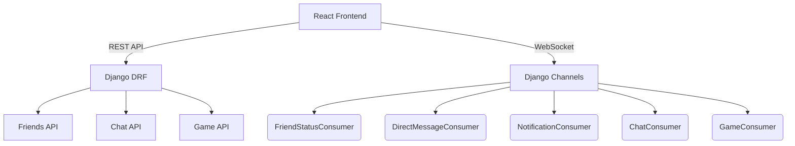
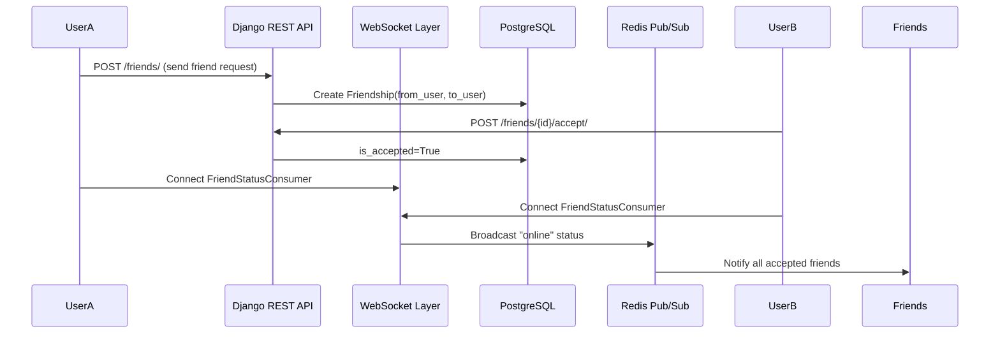

# 🤝 OneVOne Friends System — Overview

## 🌐 System Context: The OneVOne Ecosystem

The **OneVOne platform** is a full-stack social multiplayer framework integrating:
- Real-time chat and gameplay via **Django Channels + Redis**
- Persistent friendships and notifications
- Private messaging and AI-driven assistant features

The **Friends app** serves as the foundation for **social connectivity** — managing friendships, friend requests, and online/offline presence, which tie directly into:
- `chat` (direct messages + invites)
- `notifications` (badges/toasts)
- `game` (friend invites to game lobbies)

---

## 🧩 Friends App Purpose

The **Friends app** enables users to:
- Send and accept friend requests
- View pending requests
- See which friends are online or offline
- Receive real-time status updates

This app underpins the entire social graph for OneVOne — every chat, DM, or game invitation flows through established friend relationships.

---

## ⚙️ Architecture Flow

---

## 🧠 Key Components

| Module | Responsibility |
|--------|----------------|
| **models.py** | Defines `Friendship` model and helper for determining the “other” user. |
| **serializers.py** | Validates friend requests, ensures uniqueness, and computes friend details. |
| **views.py** | Provides REST actions: send, accept, decline, list. |
| **consumers.py** | Handles real-time presence tracking (online/offline). |
| **routing.py** | Defines WebSocket route for presence updates. |
| **urls.py** | Exposes REST API endpoints for friendship management. |

---

## 💡 Developer Insights

- Presence updates are broadcast using **Redis pub/sub** through Channels.
- Friendship validation uses **symmetrical filtering** via `Q(from_user=... | to_user=...)`.
- Designed for **horizontal scalability** — any worker can publish status events to all connected clients.
- Extensible for future “friend activity” or “party” features.

---
