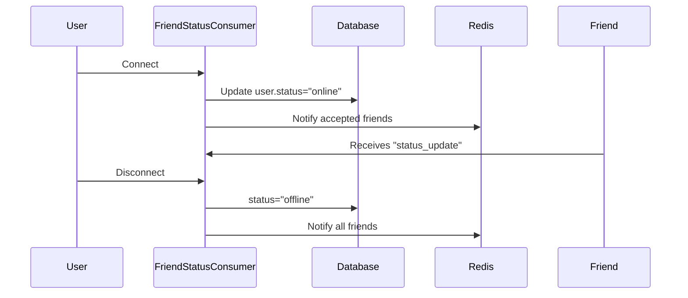

# 🧩 Module: consumers.py

## 📘 Purpose
Tracks **user online/offline presence** in real time using WebSockets.

---

## ⚙️ Responsibilities
- Authenticate WebSocket connections.
- Mark user as online upon connect.
- Mark user as offline upon disconnect.
- Broadcast status updates to all accepted friends.

---

## 🔄 Presence Flow

---

## 💡 Developer Insights
- Each user joins a personal group `user_{id}`.
- `broadcast_status_to_friends()` sends status updates through Redis to all accepted friends.
- Ideal for pairing with `NotificationConsumer` for unified UX.

---
