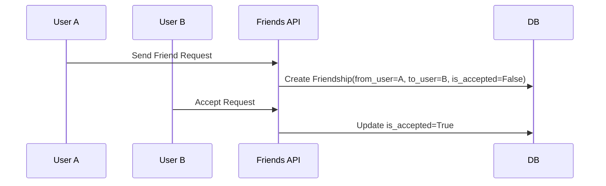

# 🧩 Module: models.py

## 📘 Purpose
Defines the `Friendship` model that represents friend relationships between users.

---

## ⚙️ Model Structure

| Field | Type | Description |
|--------|------|--------------|
| `from_user` | FK(User) | The sender of the friend request |
| `to_user` | FK(User) | The receiver of the friend request |
| `is_accepted` | Boolean | Indicates if the request is accepted |
| `created_at` | DateTime | Timestamp of request creation |

---

## 🔄 Example Lifecycle



---

## 🧱 Helper Method

```python
def get_other_user(self, current_user):
    if self.from_user == current_user:
        return self.to_user
    elif self.to_user == current_user:
        return self.from_user
    return None
```

Returns the “other” user in a friendship context — used by serializers and chat logic.

---

## 💡 Developer Insights
- `unique_together` prevents duplicate friendships.
- The `ordering` by `-created_at` ensures recent requests appear first.
- DB table is explicitly named `users_friendship` for clarity.

---
